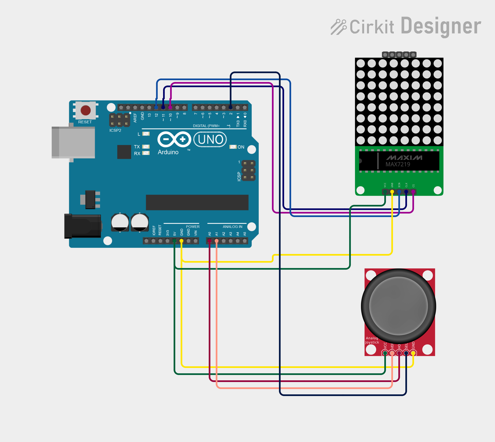

# Mind_Snap

A memory game for an **8x8 LED matrix**, an **analog joystick** and an **Arduino**, built for a robotics workshop.

The matrix shows a random pattern for a few seconds. The pattern disappears, and you have to **recreate it from memory** by moving a blinking cursor with the joystick and pressing the joystick button to lock each square. The further you go, the smaller the squares get, so the game keeps getting harder.

---

## Table of contents

1. [What you need](#1-what-you-need)
2. [How the game works](#2-how-the-game-works)
3. [Connections (wiring)](#3-connections-wiring)
4. [Installing the Arduino IDE](#4-installing-the-arduino-ide)
5. [Installing the LedControl library](#5-installing-the-ledcontrol-library)
6. [Uploading the game](#6-uploading-the-game)
7. [Playing the game](#7-playing-the-game)

---

## 1. What you need

| Part | Notes |
|---|---|
| Arduino Uno | 
| USB cable | The correct type for your board (Uno: USB-B, Nano: Mini-USB or Micro-USB) |
| 8x8 LED matrix with **MAX7219** driver | The module with 5 pins: VCC, GND, DIN, CS, CLK |
| **HW-504** analog joystick module | 5 pins: GND, +5V, VRx, VRy, SW |
| Jumper wires | Male-to-female |
| A computer | Windows, macOS or Linux |

---

## 2. How the game works

1. A random pattern is shown on the matrix for a few seconds.
2. The matrix goes blank. A **blinking cursor** appears in the middle.
3. Move the cursor with the **joystick**.
4. **Press the joystick button** to lock a square (it stays lit). Press again on a locked square to unlock it.
5. When you have locked **as many squares as the pattern had**, the game checks your answer automatically.
6. **Correct:** the matrix shows your **new level number**, then the next round starts.
   **Wrong:** a cross appears, the correct pattern is shown, and the game restarts at level 1.

### Difficulty stages

The size of one "square" shrinks as you level up. Each new stage also starts with fewer squares, so the jump in difficulty is fair.

| Stage | Levels | Square size |
|---|---|---|---|---|
| 1 | 1 - 6 | 2x2 LEDs (big squares) | 
| 2 | 7 - 10 | 2x1 LEDs (rectangles) |  
| 3 |  1x1 LED (single pixel) | 

---

## 3. Connections (wiring)

**Do all wiring with the Arduino unplugged from USB.**

### MAX7219 LED matrix to Arduino

| Matrix pin | Arduino pin |
|---|---|
| VCC | 5V |
| GND | GND |
| DIN | D12 |
| CS | D10 |
| CLK | D11 |

### HW-504 joystick to Arduino

| Joystick pin | Arduino pin |
|---|---|
| GND | GND |
| +5V | 5V |
| VRx | A0 |
| VRy | A1 |
| SW | D2 |

### Wiring tips

- Both modules need 5V and GND.
- Many matrix modules have two 5-pin headers. Connect to the **input** side (labelled **DIN**), not the output side (**DOUT**).
- Leave pin **A5 unconnected**. The code reads it to get random numbers so that every game is different.
- The joystick button (SW) uses the Arduino's built-in pull-up resistor, so you do not need an extra resistor.

> **Photo of the wiring:** ``

---

## 4. Installing the Arduino IDE

The Arduino IDE is the free program used to write code and upload it to the board.

### Step 1: Download

1. Open **https://www.arduino.cc/en/software** in your browser.
2. Under **Arduino IDE**, choose the download for your system:
   - **Windows:** "Windows Win 10 and newer, 64 bits" (installer)
   - **macOS:** the Apple Silicon or Intel version that matches your Mac
   - **Linux:** the AppImage or ZIP file
3. You may see a donation page. You can choose **"Just download"**.

### Step 2: Install

- **Windows:** double-click the downloaded `.exe` and follow the installer. Accept the driver prompts if they appear.
- **macOS:** open the `.dmg` and drag **Arduino IDE** into the **Applications** folder.

### Step 3: Connect the Arduino

1. Plug the Arduino into the computer with the USB cable.
2. Open the Arduino IDE.
3. Go to **Tools > Board** and choose your board:
   - **Arduino Uno:** *Arduino AVR Boards > Arduino Uno*
   - **Arduino Nano:** *Arduino AVR Boards > Arduino Nano*
4. Go to **Tools > Port** and choose the port that appeared when you plugged in the board:
   - Windows: `COM3`, `COM4`, etc.
   - macOS: `/dev/cu.usbmodem...` or `/dev/cu.usbserial...`
   - Linux: `/dev/ttyUSB0` or `/dev/ttyACM0`

---

## 5. Installing the LedControl library

The game uses the **LedControl** library to talk to the MAX7219 matrix.

1. In the Arduino IDE, click the **Library Manager** icon on the left side (the books icon), or go to **Sketch > Include Library > Manage Libraries...**
2. In the search box, type **LedControl**.
3. Find **LedControl** by **Eberhard Fahle** in the results.
4. Click **Install**. If it asks about dependencies, click **Install all**.
5. Wait until it shows **INSTALLED**.

> Make sure you pick the one by **Eberhard Fahle**. Other libraries have similar names and will not work with this code.

---

## 6. Uploading the game

   > The Arduino IDE needs the `.ino` file to be inside a folder with the **same name**. This is already set up correctly in this download.
2. Open the Arduino IDE and go to **File > Open...**, then pick `pattern_memory_game.ino`.
3. Check that the correct **Board** and **Port** are selected (**Tools** menu).
4. Click the **Verify** button (check mark) to compile. Wait for "Done compiling".
5. Click the **Upload** button (right arrow). Wait for **"Done uploading"**.
6. The matrix flashes fully on **twice**, and then the first pattern appears.

---

## 7. Playing the game

1. Power the Arduino over USB (or any 5V supply).
2. Watch the pattern carefully while it is on screen.
3. When the matrix goes blank, move the blinking cursor with the joystick.
4. Press the joystick down to lock a square. Press again on a locked square to remove it.
5. Lock exactly as many squares as were in the pattern. The game checks automatically.
6. Get it right and you will see your new level number. How far can you get?

The cursor **wraps around** the edges, so moving off the right edge brings you to the left.

---

Have fun and happy building!
